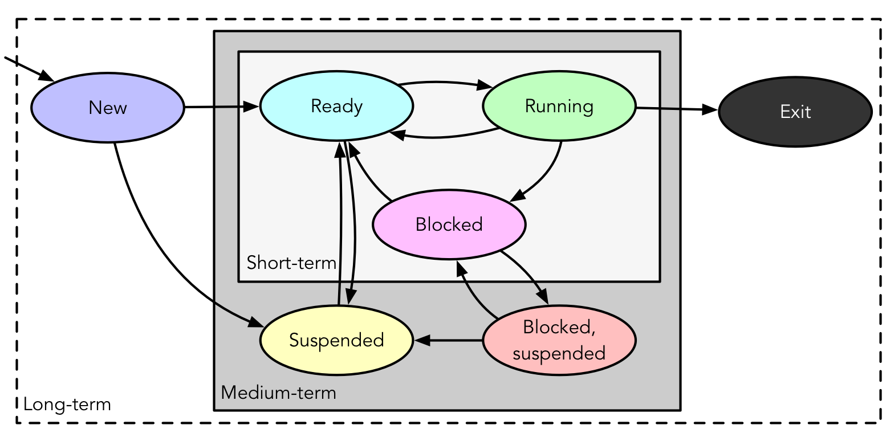

# Scheduling
Deciding which task to assign to a resource at a given time, such as...
- Handling I/O requests
- Transitioning process states
- Selecting processes for execution based on various criteria:
	- **Long-term**: New $\to$ Ready, * $\to$ Exit
	- **Medium-term**: Suspend, Unsuspend
	- **Short-term**: Ready $\to$ Running

## Long-term Scheduling
- Involves admitting processes to the ready queue
	- **Batch**: Jobs added to batch queue; scheduler decides...
		- When OS can accept new processes
		- Which job to prioritise first
	- **Time-sharing**: Grant until saturation: `fork(2)` bomb
- Transitions processes from *New* to *Ready* state for execution.

## Short-term Scheduling
- Also known as *Dispatcher*
- Chooses a **Ready** process to execute
- Triggers when curren process blocks, on an interrupt (I/O or timer), or on a syscall.
- Transitions processes from *Ready* to *Running* state to ensure efficient CPU utilisation

# Criteria
Divided into two categories, focusing on different aspects of performance and efficiency in scheduling:
### System Oriented:
- **Performance**:
	- **Throughput**: Processes/work completed per unit time
	- **Utilisation**: Percentage of time that processor is busy
- **Other**:
	- **Fairness**: Treated the same, absence of starvation
	- **Priorities**: Higher priority first
	- **Balancing resources**: Bsuy but not overstressed
### User Oriented:
- **Performance**:
	- **Turnaround Time**: Submissions to completion
	- **Response time**: Respose to start of response
	- **Deadlines**: Maximize percentage of deadlines met
	- **Predictability**: Runs in same time regardless of load

# Scheduling Policies
- Rules and strategies used to determine which task or process to assign to system resources at any given time
- Scheduling strategies and algorithms applicable to uniprocessor systems without strict real-time constraints:
	- **Selection function**: *What gets to go next*
		- $w:$ time spent in system so far, *waiting*
		- $e:$ time spent in execution so far
		- $s:$ (estimated) total time required by process
	- **Decision mode**: *When selection function is executed*
		- **Preemptive**: OS may preempt running process
		- **Non-preempting**: No such pre-emption

# Scheduling Metrics
- **Service time**: Represents total execution time, $T_s$
- **Turnaround/residence time (TAT)**: Represents total waiting time, $T_r$
	- $T_r = \text{waiting} + T_s$
- **Normalised turnaround time**: Indicates service quality
	- $T_r/T_s$
	- minimum = 1; larger values indicate poorer service.

# Synchronization Granularities
- **Independet parallelism**: No explicit synchronization time sharing
- **Coarse-grained**: Involves concurrent processes and message passing in a distributed system
- **Medium-grained**: Includes multitasking within an application thread scheduling
- **Fine-grained**: Involves parallelism in single instruction stream instruction reordering (i.e., with instruction reordering)

# Design Issues
Design issues in scheduling involve...
- assignment of process to processors
- use of multiprogramming on individual processors
- dispatching

# Process Assignment
- **Static**: Processes permanently assigned to processors (dedicated queue for each professor)
	- **Pros**:
		- Low scheduling overhead
		- Allows group/gang scheduling
	- **Cons**
		- A processor may be idle whil others have backlog
- **Dynamic**: Processes scheduled on any available processor
	- **Pros**:
		- Less change of idleness and backlog
	- **Cons**
		- Higher scheduling overhead
	- **Dynamic Load Balancing**: Multiple queues, but processes moved between queues to balance load.

# Assignment
Assignment of processes can be done in different ways depending on the scheduling method. For example...
- **Leader/Follower**: Decisions are mode on one processor
	- **Pros**:
		- Simple
		- Conflict resolution straightforward
	- **Cons**
		- Leader can bottleneck
- **Peer**: Scheduling can happen on any processor
	- **Pros**:
		- Eliminates bottleneck processor
	- **Cons**
		- Complicates OS
		- Must ensure processors don't choose same process
		- Conflicts for resources need to be managed

# Dispatching Algorithms
Determines task execution order and efficiency
## First Come First Served (FCFS)
- Processes chose from the fron of the ready queue in order of arrival
- Better for long processes, but may lead to poor turnaroud due to *convoy effect*
- Not ideal for short processes, as it can cause delays in execution

## Shortest Process Next (SPN)
- Also known as *Shortest Job First (SJF)*
- Selects shortest job in the ready queue for execution
- Optimal average Turnaround Time (TAT) **if all jobs arrive together**...
- ...but risk of starvation for long processes
- **Assumes** knowledge of job lengths

## Shortest Remaining Time (SRT)
- Preemptive version of SPN
- Prioritises process with shortest remaining process time
- Good turnaround time
- Avvoids bias to longer processes
- Low overhead
- Need estimate of required processing time

## Round Robin
- Also known as time slicing
- FCFS with clock based preemption
- Each process gets a time slice (quantum) to execute
	- Smaller quantum reduces response time
	- Too small can increase overhead
- Favours processor-bound processes

## Virtual Round Robin
- Involves multiple process queues
- I/O queues feed into aux queue
	- Aux queue is prioritised over ready queue for process execution
- i.e., Helps manage process priorities efficiently in a multi-process environment

## Highest Response Ratio Next
$R = \frac{w+s}{s}\newline$
$w=$ Time spent waiting
$\newline s=$ Expected service time
- Selects the ready process with the largest value of response ratio, $R$
- Favours shorter jobs and brings lognger jobs to the top based on age
- i.e., Helps minimise waiting time by prioritising processes with a higher expected service time

## Fair-Share Scheduling
- Ensures each user or process group get as a fair share of processor time
- **up to now**: homogenous pool of processes
- **multi-user environment**: groups of user processos
- Ensure each user gets "fair share" of processor time
- Dynamic priority adjustments on usage within group
- **Networking**: *Weighted fair queueing*
- Implemented in Linux with the Completely Fair Scheduler (CFS) to maintain fairnes sin resources allocation